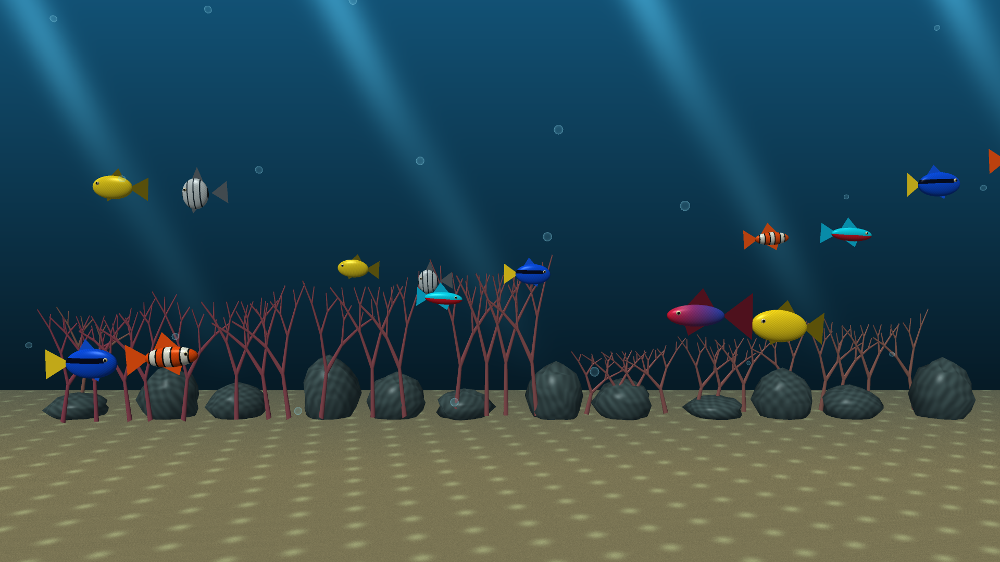
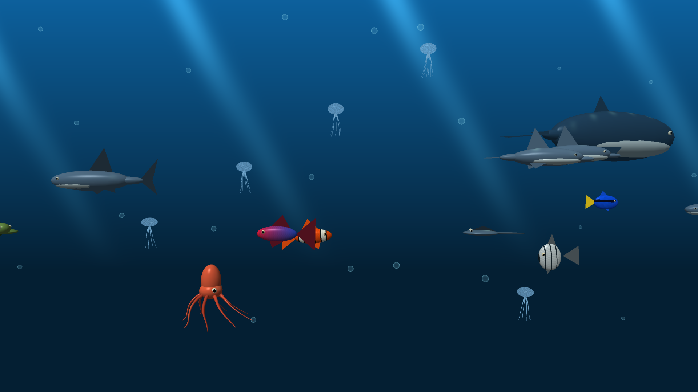

<p align="center">
    <picture>
        <source media="(prefers-color-scheme: dark)" srcset="art/banner-dark.svg">
        <source media="(prefers-color-scheme: light)" srcset="art/banner-light.svg">
        
    </picture>
</p>

<p align="center">An offline 4K aquarium screensaver for Fire TV with customizable fish, sea life, backgrounds, and sunlight.</p>

<p align="center">
    <a href="https://github.com/jeremykenedy/fire-tv-aquarium/releases"></a>
    <a href="https://github.com/jeremykenedy/fire-tv-aquarium/releases/latest"></a>
    <a href="https://github.com/jeremykenedy/fire-tv-aquarium/actions/workflows/tests.yml"></a>
    <a href="https://github.com/jeremykenedy/fire-tv-aquarium/actions/workflows/style.yml"></a>
    <a href="https://github.com/jeremykenedy/fire-tv-aquarium/actions/workflows/docs.yml"></a>
    <a href="https://github.com/jeremykenedy/fire-tv-aquarium/actions/workflows/security.yml"></a>
    <a href="LICENSE"></a>
</p>

## Table of Contents

- [Requirements](#requirements)
- [Installation](#installation)
- [Quick Start](#quick-start)
- [Features](#features)
- [Configuration](#configuration)
- [Screenshots](#screenshots)
- [Documentation](#documentation)
- [Testing](#testing)
- [Continuous Integration](#continuous-integration)
- [Privacy](#privacy)
- [Media License](#media-license)
- [License](#license)

## Requirements

- A 4K Fire TV with OpenGL ES 2.0 and Android API 23 or newer.
- A computer with Python 3.10 or newer and Android Platform Tools (`adb`).
- ADB debugging enabled on the TV and a connection from your computer.
- GitHub access to this repository to download its private releases.

The app has been tested on a Fire TV running Android API 30 with a 4K panel.
Other models and Fire OS versions need device verification. Build requirements
are listed in [Building](docs/BUILDING.md).

## Installation

Clone the repository, download the signed APK and its checksum, and connect to
ADB. Replace `DEVICE_IP` with your TV's address:

```bash
git clone git@github.com:jeremykenedy/fire-tv-aquarium.git
cd fire-tv-aquarium
mkdir -p build
gh release download --repo jeremykenedy/fire-tv-aquarium \
  --pattern aquarium-4k.apk --pattern aquarium-4k.apk.sha256 --dir build
adb connect DEVICE_IP:5555
python3 install.py --device DEVICE_IP:5555
```

The installer verifies the checksum, installs or upgrades Aquarium 4K, and
selects it as the idle screensaver. It keeps your existing idle and sleep
timeouts and saves the original screensaver settings in ignored
`device-state.json`. Keep that backup to restore your previous screensaver.

See [Installation](INSTALLATION.md) for developer mode, upgrades, restoring the
previous screensaver, and removing the app.

## Quick Start

Open **Aquarium 4K** from the Fire TV app list.

| Remote button | Action |
|---|---|
| Up / Down | Select a setting |
| Left / Right | Adjust the selected setting |
| Select | Advance an option or activate a button |
| Menu | Open settings from the full-screen preview |
| Back | Return to settings, or exit when settings are already visible |

Changes are saved immediately. **Show aquarium** opens the full-screen preview.
The same saved aquarium appears when the TV starts its idle screensaver. A remote
key exits the idle screensaver. **Reset aquarium** restores the default options.

## Features

- Native 3840x2160 animated rendering and a bundled silent 4K video loop.
- Reef, Fish tank, Ocean, Kelp forest, and Deep sea backgrounds.
- A few, A handful, A lot, A ton, Schools, or an exact count from 0 to 60 fish.
- Six fish species or a mixed aquarium, with coordinated groups in Schools mode.
- Independent sharks, whales, octopuses, turtles, rays, dolphins, and jellyfish.
- Fish size, swimming speed, lighting, bubbles, and sunlight shimmer from above.
- An optional 12-hour or 24-hour clock.
- Remote-operated settings with a live preview and saved preferences.
- Reversible screensaver selection, with no launcher changes.
- No ads, analytics, tracking SDKs, accounts, network permission, or runtime downloads.

Animated mode uses original stylized 3D animals and scenery. Frame rate depends
on the device and settings. **Real 4K footage** mode plays a recorded aquarium;
the fish and scenery controls apply to animated mode. The clock works in both.

## Configuration

| Setting | Options | Default |
|---|---|---|
| Mode | Animated aquarium, Real 4K footage | Animated aquarium |
| Population | Custom, A few, A handful, A lot, A ton, Schools | A handful |
| Fish | Exact count from 0 to 60 | 16 |
| Species | Mixed, Clownfish, Yellow tang, Blue tang, Angelfish, Neon tetra, Betta | Mixed |
| Background | Reef, Fish tank, Ocean, Kelp forest, Deep sea | Reef |
| Swimming | Calm, Gentle, Lively | Gentle |
| Fish size | Small, Medium, Large | Medium |
| Lighting | Daylight, Warm, Moonlight | Daylight |
| Bubbles | On, Off | On |
| Sunlight shimmer | On, Off | On |
| Sharks, Whales, Octopuses, Turtles, Rays, Dolphins, Jellyfish | Independent On / Off switches | Off |
| Clock | Hidden, 12-hour, 24-hour | Hidden |

**A few** uses 6 fish, **A handful** 16, **A lot** 32, **A ton** 60, and
**Schools** 48 fish in three coordinated groups. Adjusting the exact count
selects **Custom**. Large animals are additional to this ordinary fish count.

See [Configuration](docs/CONFIGURATION.md) for backgrounds, saved settings,
school behavior, and the sea-life switches.

## Screenshots

These are captures from the Fire TV. Its screenshot output is 1920x1080; the
actual aquarium surface and display composition were verified at 3840x2160.

<table>
    <tr>
        <td valign="top" width="50%"><br>Settings and live preview</td>
        <td valign="top" width="50%"><br>Reef with sunlight shimmer</td>
    </tr>
    <tr>
        <td valign="top" colspan="2"><br>Ocean with optional sea life</td>
    </tr>
</table>

## Documentation

- [Installation, upgrades, restore, and uninstall](INSTALLATION.md)
- [Build tools and signing keys](docs/BUILDING.md)
- [Aquarium configuration](docs/CONFIGURATION.md)
- [Architecture and lifecycle](docs/ARCHITECTURE.md)
- [CI and quality checks](docs/CI.md)
- [Release process](docs/RELEASING.md)
- [Troubleshooting](docs/TROUBLESHOOTING.md)
- [Device verification](docs/VERIFICATION.md)
- [Contributing](CONTRIBUTING.md)
- [Changelog](CHANGELOG.md)

## Testing

```bash
bash test.sh
bash build.sh
python3 check_apk.py
```

The tests cover installer integrity, rollback, settings bounds, species
selection, long-running swimming paths, and school formation. APK verification
checks the package, absence of requested permissions, bundled video storage,
and signature through the build. Device testing covers the remote controls,
persistence, preview, idle activation, exit, and actual 4K display composition.

## Continuous Integration

GitHub Actions runs the test suite, Android build, APK verification, code style,
static analysis, secret detection, and documentation checks. Actions are pinned
to immutable commits. CI builds use temporary signing keys; release APKs use the
stable application key.

See [CI](docs/CI.md) for workflow details and external service setup.

## Privacy

All animation, video, preferences, and time display stay on the TV. The Android
manifest requests no permissions. The app contains no ad or analytics libraries,
network clients, remote content, or telemetry uploads. Local renderer and player
logs help diagnose playback and never leave the device through the app.

Development and repository CI services analyze source code outside the app.
They are not included in the APK.

## Media License

The software and original animated assets use MIT. The bundled aquarium video
uses the separate Pixabay Content License; its source, attribution, and terms
are documented in [MEDIA_LICENSE.txt](MEDIA_LICENSE.txt). The software license
does not relicense that footage. No assets or code from the supplied third-party
wallpaper APKs are included.

## License

This package is open-sourced software licensed under the [MIT license](LICENSE).
