<p align="center">
    <picture>
        <source media="(prefers-color-scheme: dark)" srcset="art/banner-dark.svg">
        <source media="(prefers-color-scheme: light)" srcset="art/banner-light.svg">
        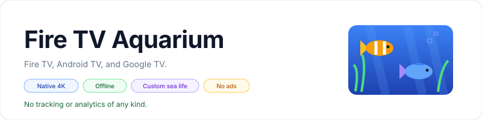
    </picture>
</p>

<p align="center">An offline 4K aquarium screensaver for Fire TV, Android TV, and Google TV with customizable fish, sea life, backgrounds, and sunlight.</p>

<p align="center">
    <a href="https://github.com/jeremykenedy/fire-tv-aquarium/releases"></a>
    <a href="https://github.com/jeremykenedy/fire-tv-aquarium/releases/latest"></a>
    <a href="https://github.com/jeremykenedy/fire-tv-aquarium/actions/workflows/tests.yml"></a>
    <a href="https://github.com/jeremykenedy/fire-tv-aquarium/actions/workflows/style.yml"></a>
    <a href="https://github.com/jeremykenedy/fire-tv-aquarium/actions/workflows/docs.yml"></a>
    <a href="https://github.com/jeremykenedy/fire-tv-aquarium/actions/workflows/security.yml"></a>
    <a href="LICENSE"></a>
</p>

<p align="center">
    <a href="https://github.com/jeremykenedy"></a>
    <a href="https://github.com/jeremykenedy/fire-tv-aquarium" title="Open the repository and click Star"></a>
</p>

## Table of Contents

- [TV Support](#tv-support)
- [Requirements](#requirements)
- [Installation](#installation)
- [Upgrades and Restoration](#upgrades-and-restoration)
- [Quick Start](#quick-start)
- [Features](#features)
- [Configuration](#configuration)
- [Screenshots](#screenshots)
- [Documentation](#documentation)
- [Troubleshooting](#troubleshooting)
- [Testing](#testing)
- [Continuous Integration](#continuous-integration)
- [Privacy](#privacy)
- [Media License](#media-license)
- [License](#license)

## TV Support

The same APK runs on Fire TV, Android TV, and Google TV using Android platform
APIs, a TV launcher entry, D-pad controls, and a system DreamService. Android API
23 or newer and OpenGL ES 2.0 are required. Physical 4K TVs use a native 3840x2160
surface; other TVs render at their supported display resolution. Original footage
uses a bundled 1080p copy when 4K decoding is unavailable or fails.

| Platform | Installation and controls | Verified environment |
|---|---|---|
| Fire TV | ADB install, TV app entry, remote settings, system idle screensaver | Physical API 30 Fire TV with native 4K display composition |
| Android TV | Same APK and installer, D-pad settings, system idle screensaver | Official API 31 emulator at 1080p |
| Google TV | Same APK and installer, D-pad settings, ADB screensaver selection | Official API 34 emulator at 1080p |

Android TV and Google TV hardware testing is still needed. Emulator results do
not establish automatic idle activation or native 4K output on every vendor's TV.

Some Google TV models hide third-party screensaver selection in their settings.
The ADB installer selects the service and verifies the saved values. Vendor
restrictions can still affect automatic idle activation. See
[Installation](INSTALLATION.md) and [device verification](docs/VERIFICATION.md).

## Requirements

- A Fire TV, Android TV, or Google TV with OpenGL ES 2.0 and Android API 23 or newer.
- A physical 4K display and compatible decoder for native 4K footage.
- A computer with Python 3.10 or newer and Android Platform Tools (`adb`).
- ADB debugging enabled on the TV and a connection from your computer.
- An internet connection on your computer to download the public release assets.

The app has been tested on a Fire TV running Android API 30 with a 4K panel.
Android TV and Google TV emulator checks are documented in verification.
Additional physical models and OS versions need device verification. Build requirements
are listed in [Building](docs/BUILDING.md).

## Installation

Clone the repository, download the signed APK and its checksum, and connect to
ADB. Replace `DEVICE_IP` with your TV's address:

```bash
git clone https://github.com/jeremykenedy/fire-tv-aquarium.git
cd fire-tv-aquarium
mkdir -p build
gh release download --repo jeremykenedy/fire-tv-aquarium \
  --pattern aquarium-4k.apk --pattern aquarium-4k.apk.sha256 --dir build
adb connect DEVICE_IP:5555
python3 install.py --device DEVICE_IP:5555
```

The installer verifies the checksum, installs or upgrades Aquarium 4K, and
selects it as the idle screensaver. It keeps your existing idle and sleep
timeouts and saves the original screensaver settings in ignored
`device-state.json`. Keep that backup to restore your previous screensaver.

The repository and releases are public. You can download the APK and checksum
directly from the [latest release](https://github.com/jeremykenedy/fire-tv-aquarium/releases/latest)
without repository access or a GitHub account. GitHub CLI commands require CLI
authentication; the release page provides a browser download alternative.

See [Installation](INSTALLATION.md) for developer mode, upgrades, restoring the
previous screensaver, and removing the app.

For a second TV, use `--state-file device-states/bedroom.json` with a unique path
and reuse that path for upgrades and restoration. Paired wireless ADB can use
ports other than 5555; use the connected serial shown by `adb devices`.

## Upgrades and Restoration

Download both assets from the same release before upgrading:

```bash
gh release download --repo jeremykenedy/fire-tv-aquarium \
  --pattern aquarium-4k.apk --pattern aquarium-4k.apk.sha256 --dir build --clobber
python3 install.py --device DEVICE_IP:5555
```

The installer uses an in-place upgrade. Matching package and signing identity
retain aquarium preferences, and the first saved screensaver backup remains the
restore baseline. Version 1.3.0 keeps the signing identity and minimum Android
version of 1.2.0. Existing choices remain fixed until you select Random.

To select the previous screensaver again:

```bash
python3 install.py --device DEVICE_IP:5555 --restore
```

If installation used `--state-file`, include the same flag when restoring.
Restore leaves Aquarium installed. To remove it, restore first and then follow
the [uninstall instructions](INSTALLATION.md#uninstall). Uninstalling deletes
aquarium preferences. Idle and sleep timeouts are preserved throughout.

## Quick Start

Open **Aquarium 4K** from your TV app list.

| Remote button | Action |
|---|---|
| Up / Down | Select a setting |
| Left / Right | Adjust the selected setting |
| Select | Advance an option or activate a button |
| Menu | Open settings from the full-screen preview |
| Back | Return to settings, or exit when settings are already visible |

Changes are saved immediately. **Show aquarium** opens the full-screen preview.
Random settings are picked again on Show aquarium and on each idle activation.
Fixed choices stay fixed. A remote
key exits the idle screensaver. **Reset aquarium** restores the default options.

## Features

- Native 3840x2160 output on 4K TVs, with lower-resolution display and video fallbacks.
- One APK for Fire TV, Android TV, and Google TV.
- Random version selection with an editable pool of the six looks and original footage.
- Random choices for every aquarium setting, chosen once per showing.
- Realistic, Classic Windows aquarium, Animated 3D, Cartoon, Finding Nemo inspired,
  and Little Mermaid inspired appearances.
- Reef, Fish tank, Ocean, Kelp forest, and Deep sea backgrounds.
- A few, A handful, A lot, A ton, Schools, or an exact count from 0 to 60 fish.
- Six fish species or a mixed aquarium, with coordinated groups in Schools mode.
- A saved Day / Night switch dims every animated look and the original video.
- Independent sharks, whales, octopuses, turtles, rays, dolphins, and jellyfish.
- Fish size, swimming speed, lighting, bubbles, and sunlight shimmer from above.
- An optional 12-hour or 24-hour clock.
- Remote-operated settings with a live preview and saved preferences.
- Reversible screensaver selection, with no launcher changes.
- No ads, analytics, tracking SDKs, accounts, network permission, or runtime downloads.

Realistic is the default. Appearance changes the fish and environment together
while keeping your population, background selection, and sea-life switches.
Textured appearances animate detailed artwork on deforming surfaces; Cartoon
uses the original simple 3D geometry. The animation renders to a native 4K
surface; bundled texture artwork has its own source resolution. Frame rate
depends on the device and settings. **Original 4K footage** preserves the real
aquarium video from the first version installed on the TV;
the fish and scenery controls apply to animated mode. The clock works in both.

## Configuration

| Setting | Options | Default |
|---|---|---|
| Mode | Animated aquarium, Original 4K footage, Random version | Animated aquarium |
| Look | Realistic, Classic Windows aquarium, Animated 3D, Cartoon, Finding Nemo inspired, Little Mermaid inspired | Realistic |
| Day / Night | Day, Night (40% brightness) | Day |
| Population | Custom, A few, A handful, A lot, A ton, Schools | A handful |
| Fish | Exact count from 0 to 60 | 16 |
| Species | Mixed, Clownfish, Yellow tang, Blue tang, Angelfish, Neon tetra, Betta | Mixed |
| Background | Reef, Fish tank, Ocean, Kelp forest, Deep sea | Reef |
| Swimming | Calm, Gentle, Lively | Gentle |
| Fish size | Small, Medium, Large | Medium |
| Lighting | Daylight, Warm, Moonlight | Daylight |
| Bubbles | On, Off | On |
| Sunlight shimmer | On, Off | On |
| Sharks, Whales, Octopuses, Turtles, Rays, Dolphins, Jellyfish | Independent On / Off switches | Off |
| Clock | Hidden, 12-hour, 24-hour | Hidden |

Every aquarium setting offers **Random** after its fixed choices. **Random version**
uses the enabled **Shuffle** switches to choose a look or original footage; at
least one version must remain enabled. **Look: Random** shuffles only animated
looks while keeping Mode fixed. Random population chooses one of the five presets;
Random Fish chooses an exact 0-60 count and selects Custom. Random changes take
effect in the live preview and roll again on each showing. Choices stay steady
throughout that session and are saved as Random for the next session.

**A few** uses 6 fish, **A handful** 16, **A lot** 32, **A ton** 60, and
**Schools** 48 fish in three coordinated groups. Adjusting the exact count
selects **Custom**. Large animals are additional to this ordinary fish count.

See [Configuration](docs/CONFIGURATION.md) for backgrounds, saved settings,
school behavior, and the sea-life switches.

Common combinations:

| Goal | Settings |
|---|---|
| Different versions each time | Mode: Random version; enable the Shuffle versions you want |
| Original footage every time | Mode: Original 4K footage; optionally choose Night and Clock |
| Same look, different scenery | Mode: Animated aquarium; fixed Look; Background: Random |
| A dim aquarium with changing fish | Day / Night: Night; Species: Random; Population: Random |
| Only two animated looks | Mode: Random version; enable those two Shuffle switches and disable the other five |

Shuffle exclusions apply to **Mode: Random version**. **Look: Random** uses all
six animated looks. Fish controls customize generated animation; they cannot
change the animals or scenery inside recorded footage.

## Screenshots

Most images are captures from the Fire TV. Its screenshot output is 1920x1080; the
actual aquarium surface and display composition were verified at 3840x2160.

<table>
    <tr>
        <td valign="top" width="50%">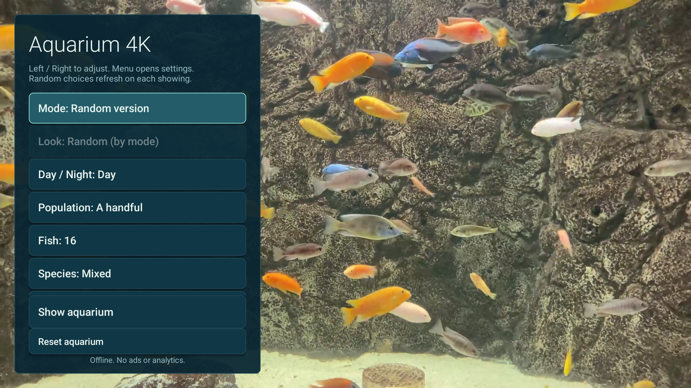<br>Google TV: Random version</td>
        <td valign="top" width="50%">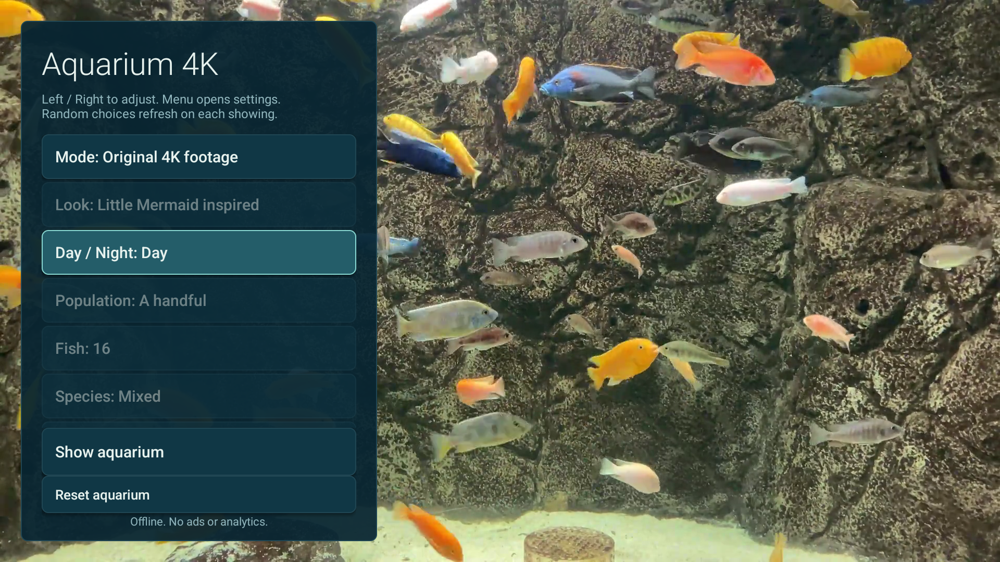<br>Android TV: local footage fallback</td>
    </tr>
    <tr>
        <td valign="top" width="50%">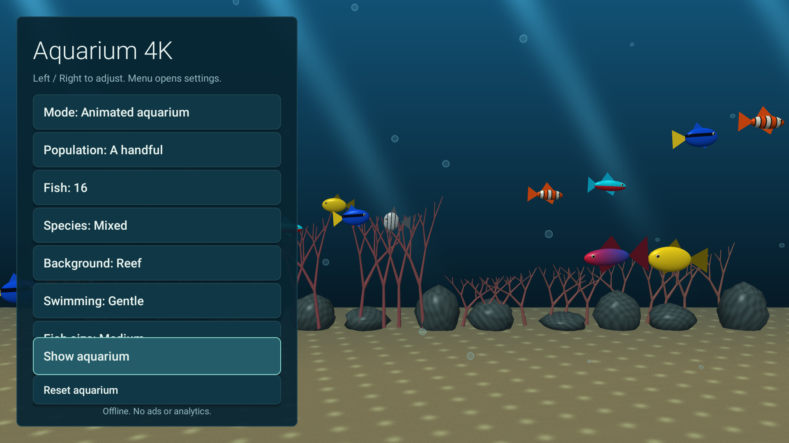<br>Settings and live preview</td>
        <td valign="top" width="50%">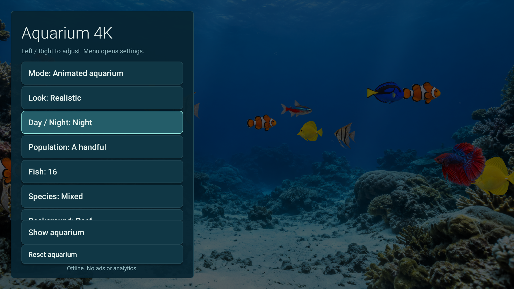<br>Night mode</td>
    </tr>
    <tr>
        <td valign="top" width="50%">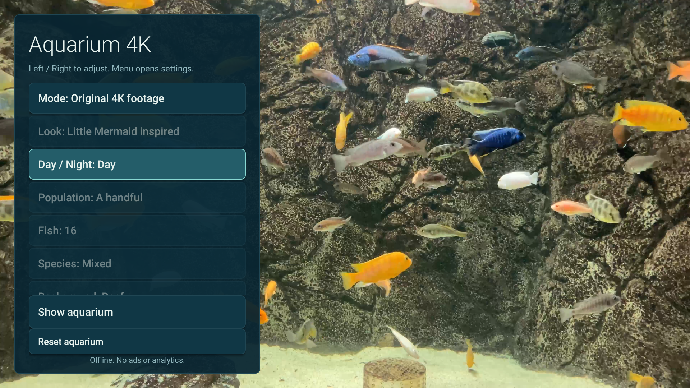<br>Original 4K footage: Day</td>
        <td valign="top" width="50%">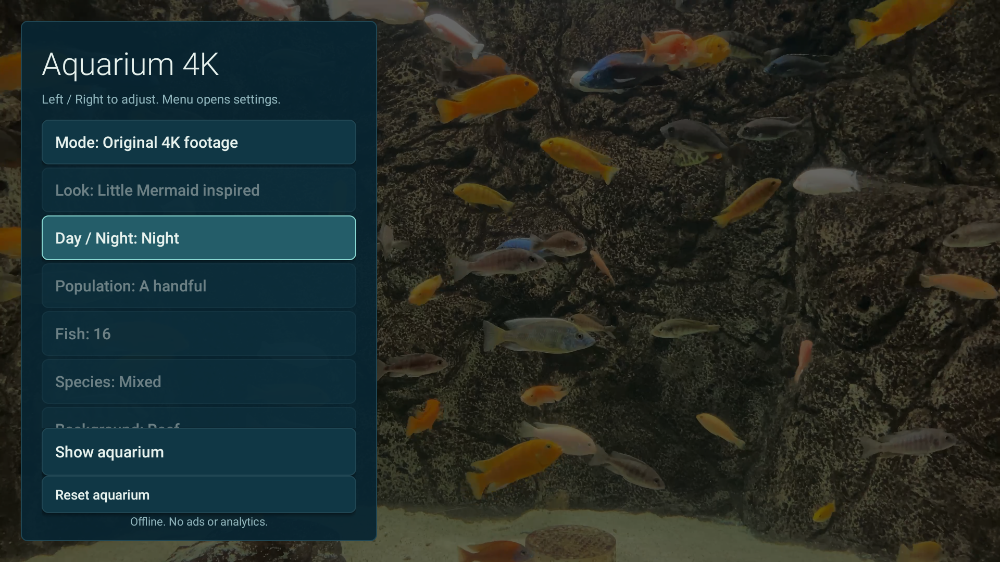<br>Original 4K footage: Night</td>
    </tr>
    <tr>
        <td valign="top" width="50%">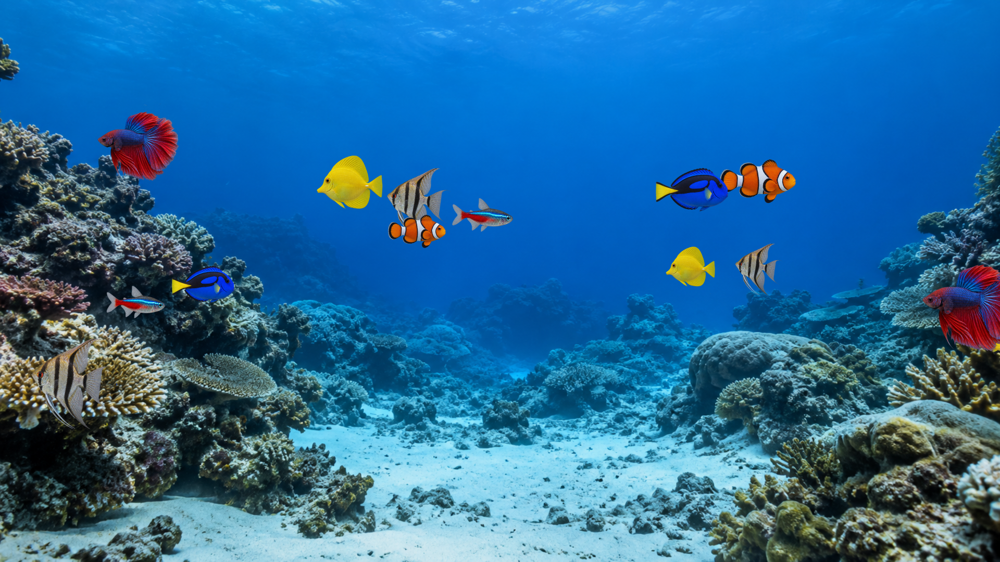<br>Realistic</td>
        <td valign="top" width="50%">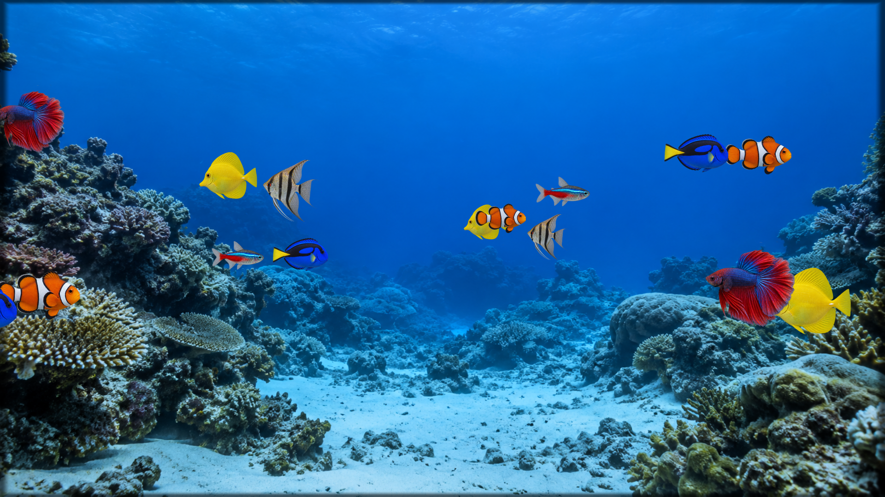<br>Classic Windows aquarium</td>
    </tr>
    <tr>
        <td valign="top" width="50%">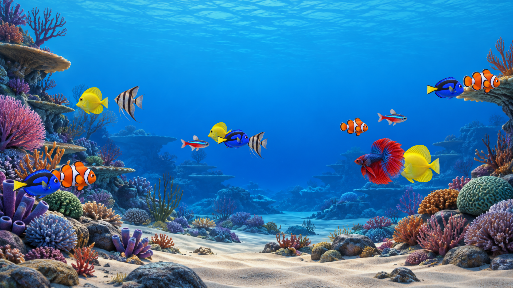<br>Animated 3D</td>
        <td valign="top" width="50%">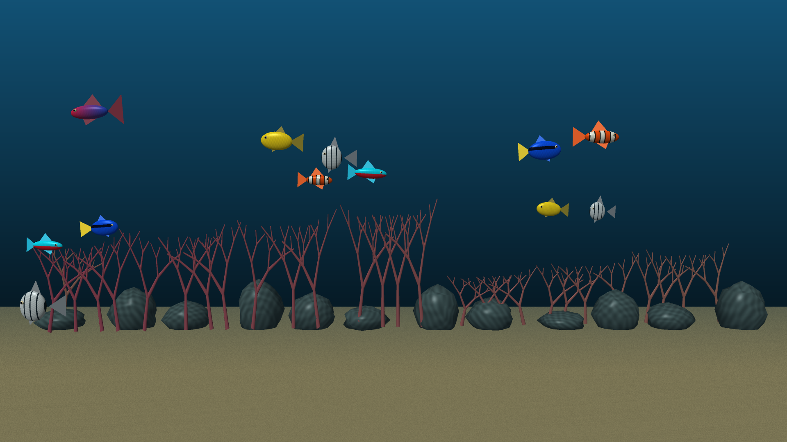<br>Cartoon</td>
    </tr>
    <tr>
        <td valign="top" width="50%">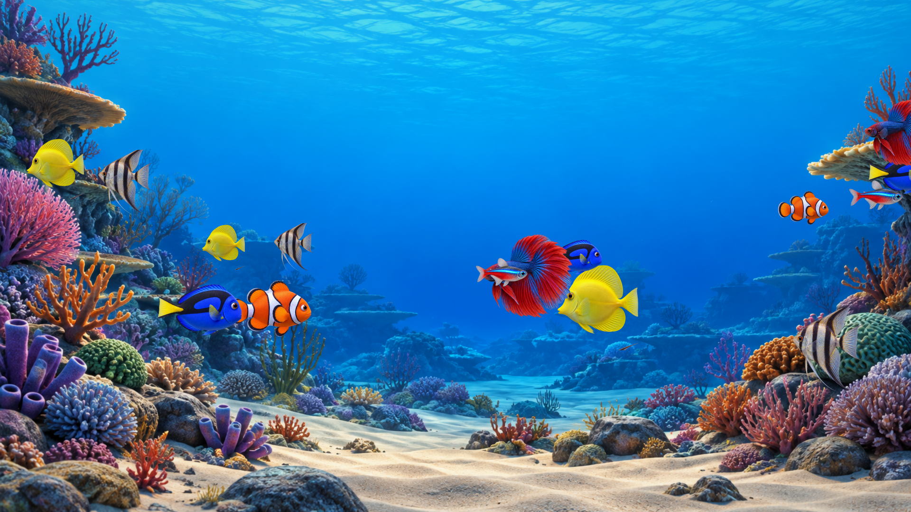<br>Finding Nemo inspired</td>
        <td valign="top" width="50%">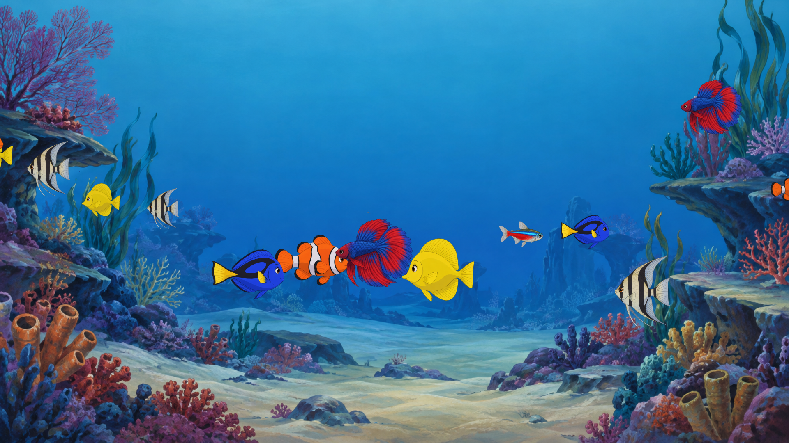<br>Little Mermaid inspired</td>
    </tr>
</table>

Random selection and fallback images are emulator captures, as labeled.
The remaining settings and video images are Fire TV screen captures. The six appearance
images were rendered on the same TV's GPU into native 3840x2160 offscreen
surfaces. All documentation images are 1920x1080. See [Verification](docs/VERIFICATION.md).

## Documentation

- [Installation, upgrades, restore, and uninstall](INSTALLATION.md)
- [Build tools and signing keys](docs/BUILDING.md)
- [Aquarium configuration](docs/CONFIGURATION.md)
- [Frequently asked questions](docs/FAQ.md)
- [Appearance artwork and rendering](docs/ARTWORK.md)
- [Architecture and lifecycle](docs/ARCHITECTURE.md)
- [CI and quality checks](docs/CI.md)
- [Release process](docs/RELEASING.md)
- [Troubleshooting](docs/TROUBLESHOOTING.md)
- [Device verification](docs/VERIFICATION.md)
- [Contributing](CONTRIBUTING.md)
- [Changelog](CHANGELOG.md)

## Troubleshooting

| Symptom | First check |
|---|---|
| TV is unauthorized or offline | Accept its ADB authorization prompt and confirm its serial with `adb devices` |
| Aquarium is missing from screensaver settings | Use the installer, then verify actual idle activation on that TV |
| Fish or scenery settings are disabled | They apply to animation; switch Mode to Animated aquarium |
| Look is disabled in Random version | The enabled Shuffle switches choose the look instead |
| Random choices repeat | Choices hold for one showing and can repeat by chance; Show aquarium rolls again |
| Video looks lower resolution | The offline 1080p fallback is selected when UHD display or decoding is unavailable |
| Upgrade reports a signature mismatch | Use the release APK or the original signing key; uninstalling removes preferences |

See [Troubleshooting](docs/TROUBLESHOOTING.md) for diagnostics and
[FAQ](docs/FAQ.md) for capability and privacy details.

## Testing

```bash
bash test.sh
bash build.sh
python3 check_apk.py
```

The tests cover installer integrity, rollback, settings bounds, species
selection, random bounds, fixed-choice preservation, shuffle exclusions,
long-running swimming paths, and school formation. APK verification
checks the package, absence of requested permissions, bundled video storage,
and signature through the build. Device testing covers the remote controls,
persistence, preview, idle activation, exit, and actual 4K display composition.

## Continuous Integration

GitHub Actions runs the test suite, Android build, APK verification, code style,
static analysis, secret detection, and documentation checks. Actions are pinned
to immutable commits. CI builds use temporary signing keys; release APKs use the
stable application key.

See [CI](docs/CI.md) for workflow details and external service setup.

## Privacy

All animation, video, preferences, and time display stay on the TV. The Android
manifest requests no permissions. The app contains no ad or analytics libraries,
network clients, remote content, or telemetry uploads. Local renderer and player
logs help diagnose playback and never leave the device through the app.

Development and repository CI services analyze source code outside the app.
They are not included in the APK.

## Media License

The software and original animated assets use MIT. The bundled aquarium video
uses the separate Pixabay Content License; its source, attribution, and terms
are documented in [MEDIA_LICENSE.txt](MEDIA_LICENSE.txt). The software license
does not relicense that footage. No assets or code from the supplied third-party
wallpaper APKs are included.

## License

This package is open-sourced software licensed under the [MIT license](LICENSE).
